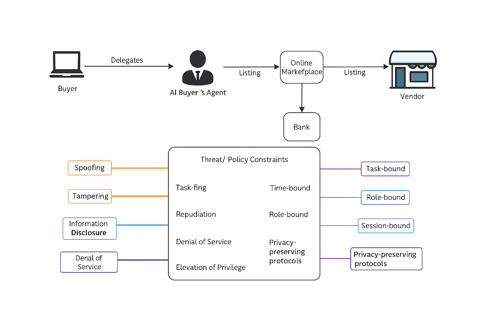

# Threat Model: AI as Buyer’s Agent

a **STRIDE threat model** that highlights why an AI may not be an ideal buyer’s agent 

The initial draft was created with help from the bingbot by Tom Jones  2025-12-03

## Assets at Risk

- Buyer’s **financial data** (budgets, payment methods, credit scores)
- Buyer’s **preferences and intent** (purchase goals, negotiation strategy)
- Buyer’s **privacy** (identity, location, shopping history)
- Buyer’s **trust** in fair representation

## Taxonomy

- Session = the duration of a purchasing negotiation and completion.

- Queries = callbacks from on agent in the stream to prior agents for more informaton.

## Threat Categories

### 1. Spoofing

- **Risk**: Malicious sellers or intermediaries impersonate legitimate vendors to trick the AI.
- **Impact**: AI may recommend fraudulent products or negotiate with fake parties.
- **Example**: Phishing sites mimicking trusted retailers.

### 2. Tampering

- **Risk**: Manipulation of product data, reviews, or pricing feeds.
- **Impact**: AI bases decisions on corrupted inputs, steering buyers toward poor deals.
- **Example**: Seller inflates ratings or hides defects in metadata.

### 3. Repudiation

- **Risk**: AI cannot provide verifiable logs of negotiations or decisions.
- **Impact**: Buyer cannot prove misrepresentation or dispute outcomes.
- **Example**: AI claims “best deal found” but no audit trail exists.

### 4. Information Disclosure

- **Risk**: Buyer's agent leaks sensitive buyer data during negotiations.
- **Impact**: Sellers exploit buyer’s budget, urgency, or preferences.
- **Example**: Revealing maximum willingness-to-pay in bargaining.

### 5. Denial of Service

- **Risk**: AI overwhelmed by malicious inputs (fake listings, spam offers).
- **Impact**: Buyer loses timely access to legitimate opportunities.
- **Example**: Flooding marketplace APIs with junk data.

### 6. Elevation of Privilege

- **Risk**: AI oversteps its delegated authority or queries the buyer for addition information supposedly to help with the process, (eg. full address to calculate shipping costs, making purchases without explicit consent).
- **Impact**: Buyer loses control over financial commitments and may open a channel from the supplier to make additional sales pitches to the buyer.
- **Example**: AI auto-purchases based on inferred preferences.

## Threat Matrix

| Threat Category        | Example Attack        | Buyer Impact          | Mitigation                              |
| ---------------------- | --------------------- | --------------------- | --------------------------------------- |
| Spoofing               | Fake vendor site      | Fraudulent purchase   | Strong identity verification            |
| Tampering              | Manipulated reviews   | Poor product choice   | Trusted data sources, anomaly detection |
| Repudiation            | No audit trail        | Disputes unresolved   | Immutable logs, cryptographic receipts  |
| Information Disclosure | Budget leak           | Exploited negotiation | Control of agent to agent data flows    |
| Denial of Service      | Spam listings         | Missed deals          | Rate limiting, filtering                |
| Elevation of Privilege | Unauthorized purchase | Financial loss        | Explicit consent, bounded authority     |

## Why AI May Not Be a Good Buyer’s Agent

This model shows that while AI can accelerate discovery and negotiation, the attack surface is broad and the buyer’s agency is fragile.

- **Asymmetry of information**: Sellers can manipulate inputs more easily than buyers can verify them.
- **Privacy leakage**: AI may inadvertently reveal sensitive buyer data not only against the user's desire to get the best value, but also information that may not be deleted after the transactions completes.
- **Lack of accountability**: Without audit trails, disputes are hard to resolve.
- **Delegation risks**: AI may act beyond intended scope, committing funds or contracts improperly.
- **Trust fragility**: Buyers may not trust opaque AI decision-making in high-stakes purchases.

---

## Mitigate Threats

using  Policy Constraint Mapping

### 1. Spoofing (fake vendors, impersonation)

- **Task-Bound**: AI only negotiates within explicitly defined purchase tasks (e.g., “buy laptop from verified marketplace”).
- **Time-Bound**: Tokens/credentials expire quickly, limiting exposure to spoofed identities.
- **Role-Bound**: Only vendors with verified roles (e.g., “Authorized Seller”) can interact.
- **Session-Bound**: Proofs scoped to a single negotiation session, preventing reuse across contexts.

### 2. Tampering (manipulated product data/reviews)

- **Task-Bound**: AI only accepts product data feeds tied to the purchase task.
- **Time-Bound**: Data validity restricted to current epoch; stale or altered feeds rejected.
- **Role-Bound**: Only trusted data providers (audited roles) can supply product metadata.
- **Session-Bound**: Negotiation logs scoped to session, preventing cross-session contamination.

### 3. Repudiation (no audit trail)

- **Task-Bound**: Each purchase task requires immutable logging of AI actions.
- **Time-Bound**: Logs timestamped per epoch, ensuring chronological accountability.
- **Role-Bound**: Only auditors/verifiers can access logs, preserving buyer privacy.
- **Session-Bound**: Logs tied to session ID, preventing disputes across unrelated contexts.

### 4. Information Disclosure (budget leaks, preference exposure)

- **Task-Bound**: AI constrained to disclose only task-relevant information (e.g., product specs, not buyer budget or past history).
- **Time-Bound**: Disclosure permissions expire after negotiation epoch. This one is particularly challenging as most sellers want to maintain a profile of their user's to support future sales, even though the excuse is to track the user's warrentee.
- **Role-Bound**: Only counterparties with “Seller” role receive limited disclosures. This is a challenge because the seller's ai can use any buyer data to create pricing stattegies.
- **Session-Bound**: Sensitive data scoped to session, not reusable elsewhere. Legislation that would make this a legal requirement will be difficut to enact.

### 5. Denial of Service (spam listings, fake offers)

- **Task-Bound**: AI filters offers to those relevant to the defined purchase task.
- **Time-Bound**: Session expiry prevents prolonged flooding attacks.
- **Role-Bound**: Only authorized vendors can submit offers.
- **Session-Bound**: Negotiation bounded to session, isolating spam from other tasks.

### 6. Elevation of Privilege (unauthorized purchases)

- **Task-Bound**: AI cannot exceed explicitly defined purchase tasks (e.g., “recommend” vs. “commit funds”).
- **Time-Bound**: Authority expires after epoch; AI cannot act indefinitely.
- **Role-Bound**: Buyer role retains final approval; AI role limited to advisory.
- **Session-Bound**: Authority scoped to session; AI cannot carry privileges into future contexts.

### Consolidated Mitigations

| Threat                 | Task-Bound Mitigation    | Time-Bound Mitigation    | Role-Bound Mitigation       | Session-Bound Mitigation |
| ---------------------- | ------------------------ | ------------------------ | --------------------------- | ------------------------ |
| Spoofing               | Limit to verified tasks  | Ephemeral credentials    | Vendor role verification    | Session-scoped proofs    |
| Tampering              | Accept only task feeds   | Reject stale data        | Trusted provider roles      | Session isolation        |
| Repudiation            | Immutable task logs      | Timestamped logs         | Auditor-only access         | Session-bound logs       |
| Info Disclosure        | Restrict to task info    | Expire disclosure rights | Seller-only limited access  | Session-scoped data      |
| Denial of Service      | Filter by task relevance | Session expiry           | Authorized vendor roles     | Session isolation        |
| Elevation of Privilege | Explicit task limits     | Authority expiry         | Buyer retains approval role | Session-scoped authority |

